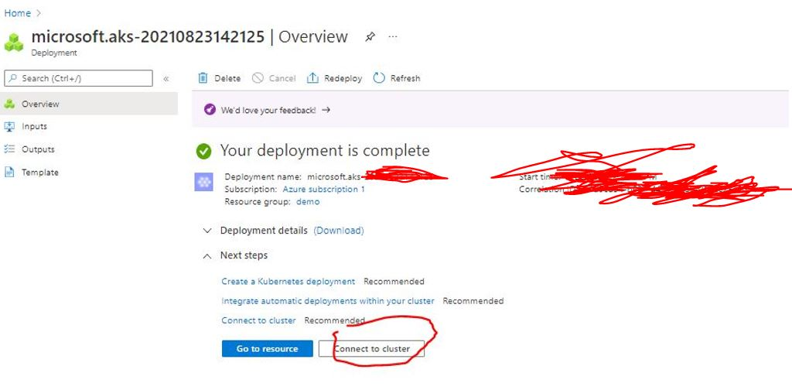

## Azure spring starter
<br>
<br>
<br>

# Create an AKS + APIM cluster (will work with free account)

Services that will be used
1. Azure AKS (external, publicly accessible)
    1. Kubernetes ingress controller
    1. Microserice Deployment (pod + service)
1. Azure APIM (external, publicly accessible)


## Create Resource group

1. open azure console @ [portal.azure.com](https://portal.azure.com)

1. click on the hambburger menu button on top left corner and select **resource groups**

    

1. click on **create**

    

1. type in desired resource group name. for this example name will be **demo**

    

1. click on create and you should be able to see your newly created resource group

    

---

<br>
<br>

## Create AKS Cluster

1. open azure console @ [portal.azure.com](https://portal.azure.com)

1. click on the hambburger menu button on top left corner and select **Create a resource**

    

1. Click on **kubernetes service > Create**

    

1. Fill up the fields, then click __Next: Node pools__. _fields used in this demo_:
    - Resource group: demo
    - Kubernetes cluster name: demo-aks
    - region: (US) East US *_selected region should have aks available_
    - availability zone: choose only  1 zone
    - scale method: manual
    - node count 1

    

1. Click __Next: Authentication__

    

1. Disable RBAC Click __Next: Networking__

    

1. Fill up fields, then click __Next: Integrations__

    

1. Disable container monitoring and then click __Review + create__

    

1. This will validate your configuratoins, and once it has passed click on __Create__

    

1. Wait for deployment to finish, then click on connect to cluster

    

    

1. Run the ff commands on your local(with az and kubectl installed) CLI to connet to the cluster

    
    ```bash
    az login # This will give you a link to login your azure credentials via browser
    # it will wait for the process to complete then you will be automatically signed in to azure CLI
    # this login expires after a few hours, if you will be using az commands the following day, you will have to login again

    #these commands are available by clicking on Connect in your azure portal -- kubernetes service UI
    az account set --subscription <subscription-id>
    az aks get-credentials --resource-group demo --name demo-aks
    ```
    

---

<br>
<br>

## Clone Repo and its Submodules then deploy to aks

1. Clone the repository and its sub modules

    ```bash
    git clone git@github.com:migueltanada/azure-springboot.git --recurse-submodules
    ```

1. Create dev namespace and switch to that namespace

    ```bash
    kubectl create namespace dev
    kubectl config set-context --current --namespace dev
    ```

1. Deploy ingress contrller(optional) *_helm should be installed_

    ```bash
    helm repo add ingress-nginx https://kubernetes.github.io/ingress-nginx
    helm repo update
    helm install ingress-nginx ingress-nginx/ingress-nginx --namespace dev #--create-namespace
    ```

1. Deploy mockapi *_helm should be installed_

    ```bash
    cd mockapi
    helm install latest helm_repo/mockapi --set configmaps.env=dev --namespace dev
    cd -
    ```

1. Access the API by getting the service address of your ingres controller *_this wil only work if you did step 3_

    ```bash
    kubectl get svc ingress-nginx-controller
    ## Ip to be used is the one in External-IP column
    curl -k https://<ip>/mock/config/sample1
    ```

---

<br>
<br>

## Create APIM

1. open azure console @ [portal.azure.com](https://portal.azure.com)

1. click on the hambburger menu button on top left corner and select **Create a resource**

    

1. Search for api management and press enter

    

1. Click Create

    

1. Fill up fields and then click on __Review + create__

    

1. Once validation is complete click on __create__

1. The deployment of APIM takes more than 20 mins. The administrator email you configured will recieve an email once deployment is done.

    

1. Once you get the mail saying your APIM is ready/active, you can opn your azure portal and go to API Management

1. Click on springmockapi > API > Add > OpenApi Specification > Fill up the fields
    - OpenAPI specification: upload swagger.json from the repository you have cloned``./mockap/swagger.json``
    - display name: mockapi

    

    

1. Test the APi using test tab in azure portal

    


