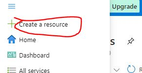
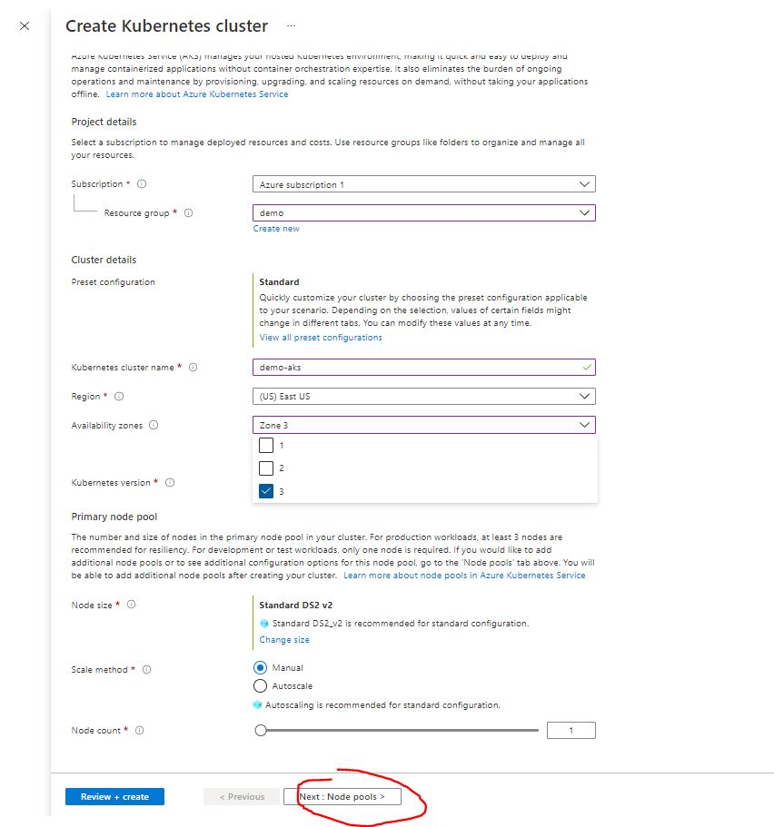
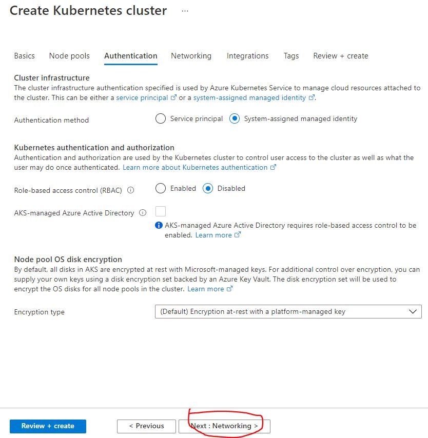
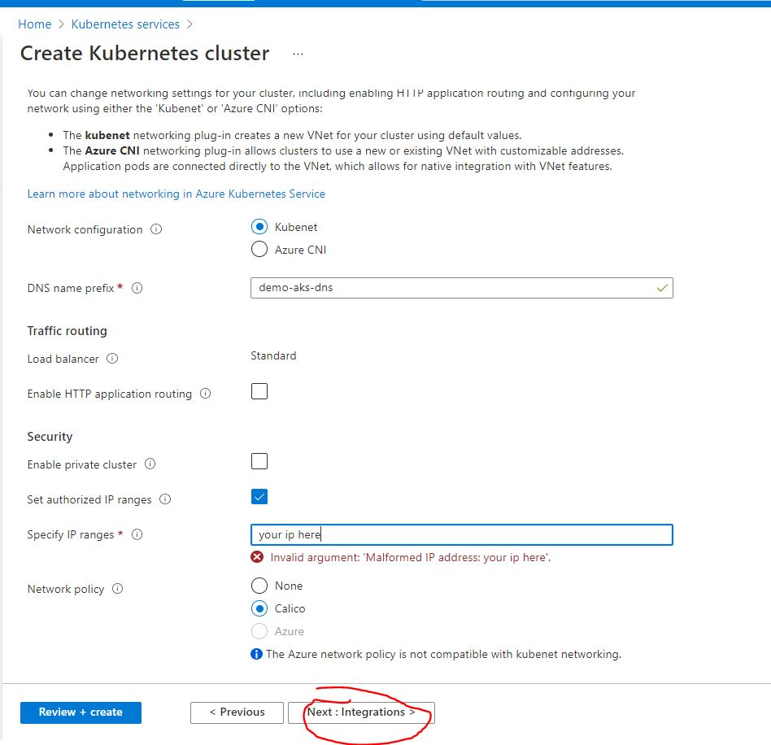
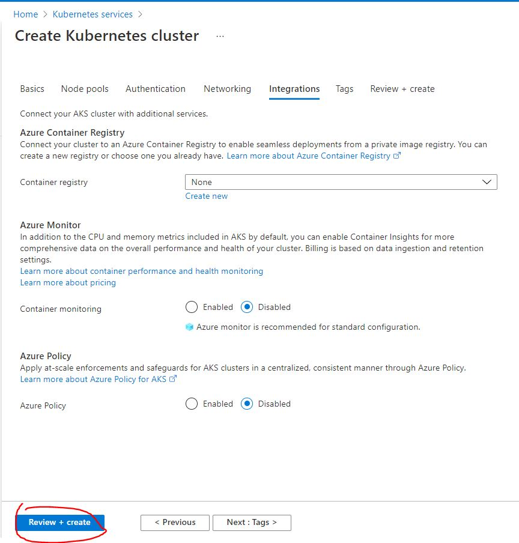
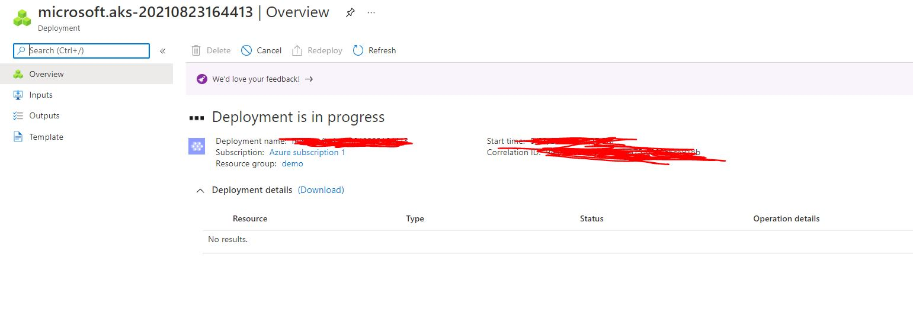
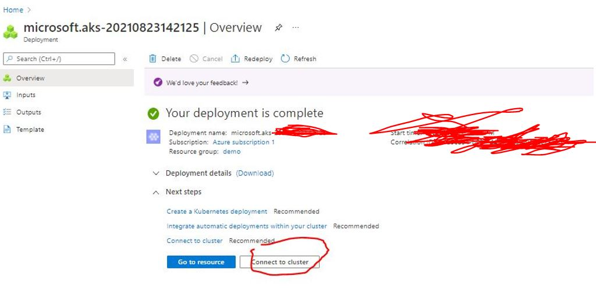
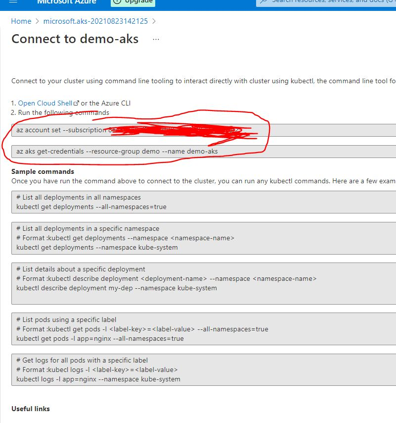

# Creating an AKS cluster

## Pre Requisites
1. Resource group -- not mandatory, can be created in aks creation wizard

## Create AKS Cluster

1. open azure console @ [portal.azure.com](https://portal.azure.com)

1. click on the hambburger menu button on top left corner and select **Create a resource**

    

1. Click on **kubernetes service > Create**

    

1. Fill up the fields, then click __Next: Node pools__. _fields used in this demo_:
    - Resource group: demo
    - Kubernetes cluster name: demo-aks
    - region: (US) East US *_selected region should have aks available_
    - availability zone: choose only  1 zone
    - scale method: manual
    - node count 1

    

1. Click __Next: Authentication__

    

1. Disable RBAC Click __Next: Networking__

    

1. Fill up fields, then click __Next: Integrations__

    

1. Disable container monitoring and then click __Review + create__

    

1. This will validate your configuratoins, and once it has passed click on __Create__

    

1. Wait for deployment to finish, then click on connect to cluster

    

    

1. Run the ff commands on your local(with az and kubectl installed) CLI to connet to the cluster

    
    ```bash
    az login # This will give you a link to login your azure credentials via browser
    # it will wait for the process to complete then you will be automatically signed in to azure CLI
    # this login expires after a few hours, if you will be using az commands the following day, you will have to login again

    #these commands are available by clicking on Connect in your azure portal -- kubernetes service UI
    az account set --subscription <subscription-id>
    az aks get-credentials --resource-group demo --name demo-aks
    ```
    

---

<br>
<br>

## Install ingress controller

1. Create dev namespace and switch to that namespace

    ```bash
    kubectl create namespace dev
    kubectl config set-context --current --namespace dev
    ```

1. Deploy ingress contrller *_helm should be installed_

    ```bash
    helm repo add ingress-nginx https://kubernetes.github.io/ingress-nginx
    helm repo update
    helm install ingress-nginx ingress-nginx/ingress-nginx --namespace dev #--create-namespace
    ```

