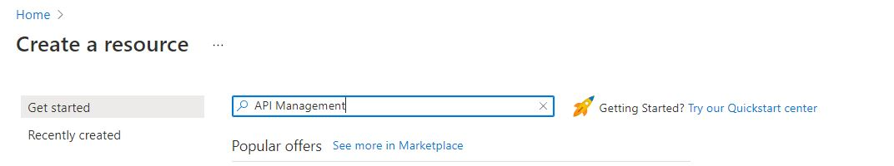
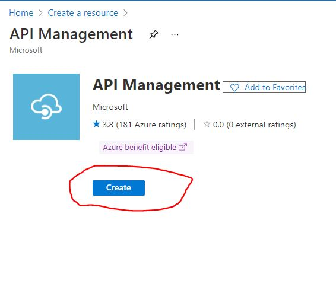
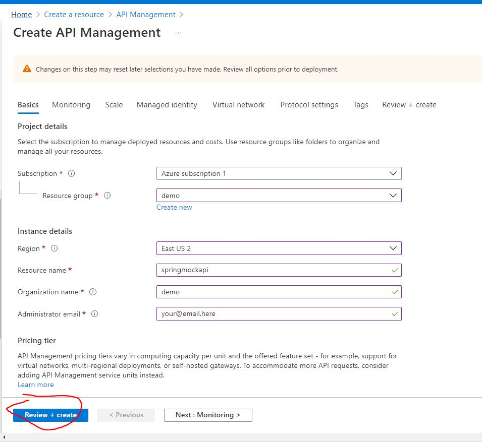
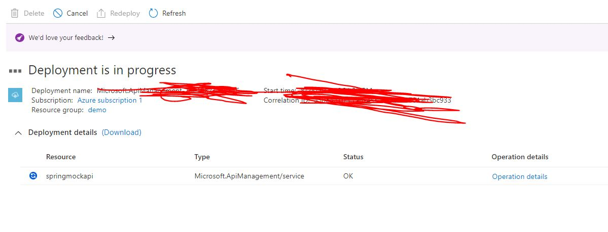

# Creating an APIM cluster

## Pre-Requisites
1. Resource Group -- not really a pre requisite, this can be created in the apim wizard itself

## Create APIM

1. open azure console @ [portal.azure.com](https://portal.azure.com)

1. click on the hambburger menu button on top left corner and select **Create a resource**

    

1. Search for api management and press enter

    

1. Click Create

    

1. Fill up fields and then click on __Review + create__

    

1. Once validation is complete click on __create__

1. The deployment of APIM takes more than 20 mins. The administrator email you configured will recieve an email once deployment is done.

    

1. Once you get the mail saying your APIM is ready/active, you can opn your azure portal and go to API Management

