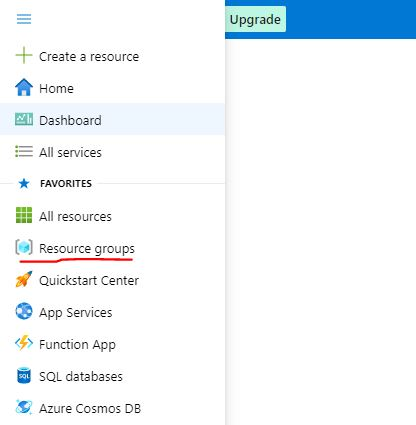
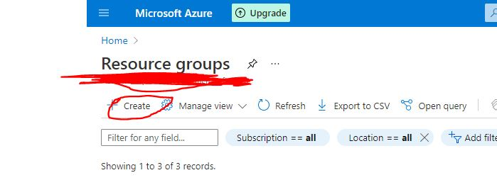
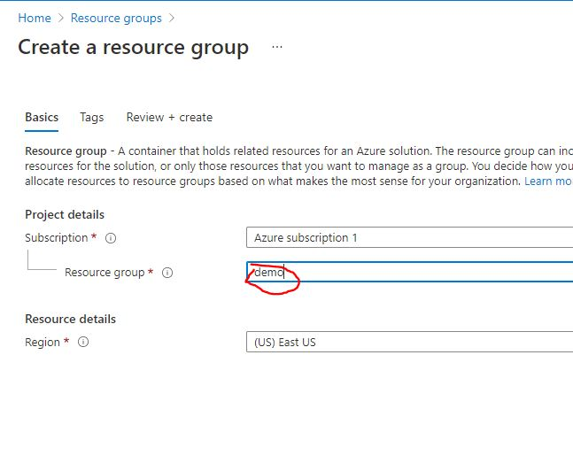
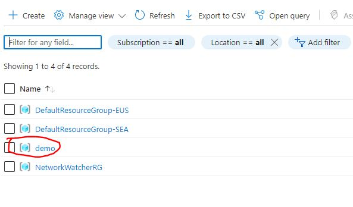

# Creating a resource group

1. open azure console @ [portal.azure.com](https://portal.azure.com)

1. click on the hambburger menu button on top left corner and select **resource groups**

    

1. click on **create**

    

1. type in desired resource group name. for this example name will be **demo**

    

1. click on create and you should be able to see your newly created resource group

    
