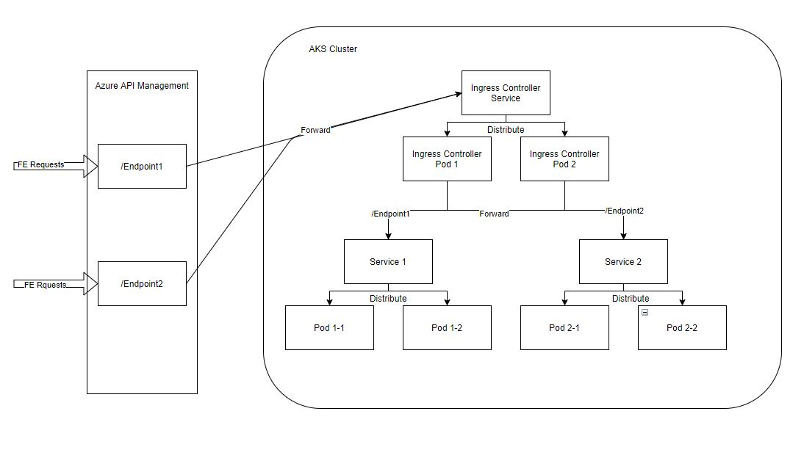
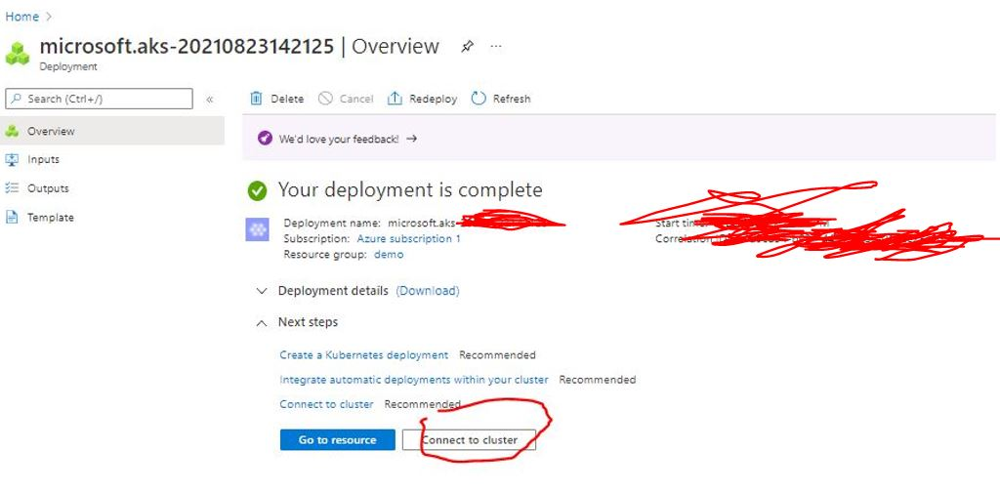
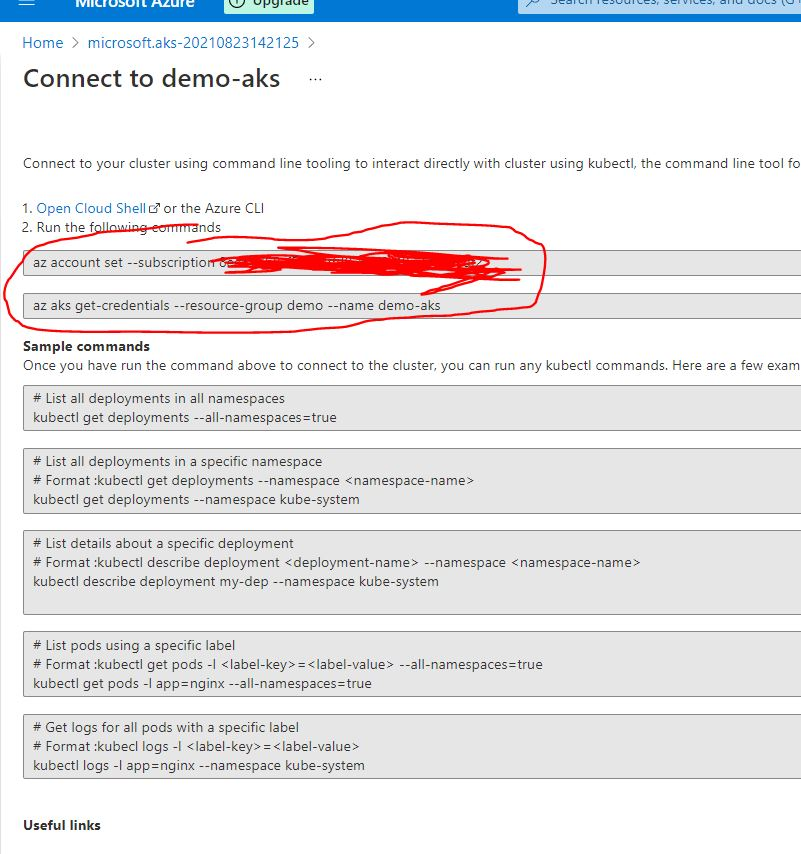
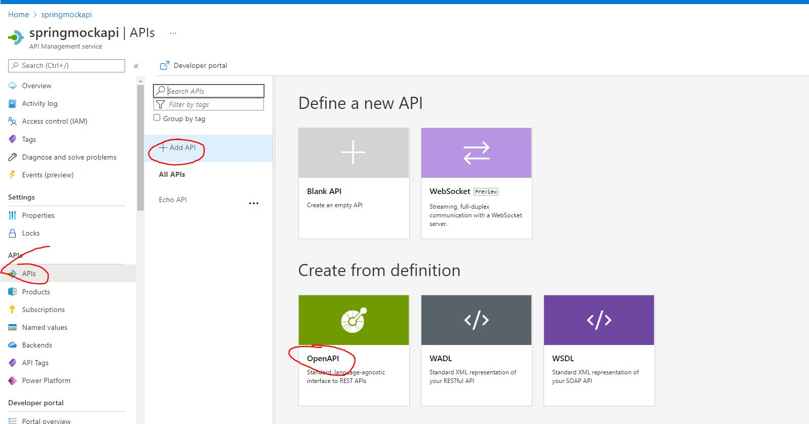
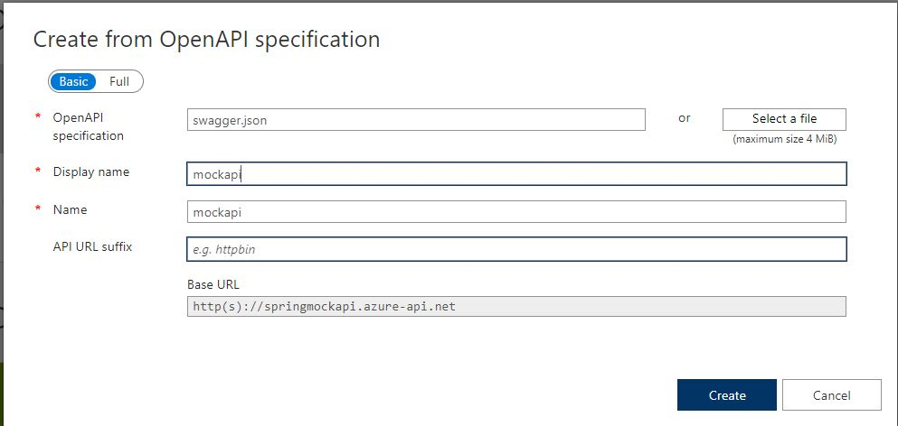
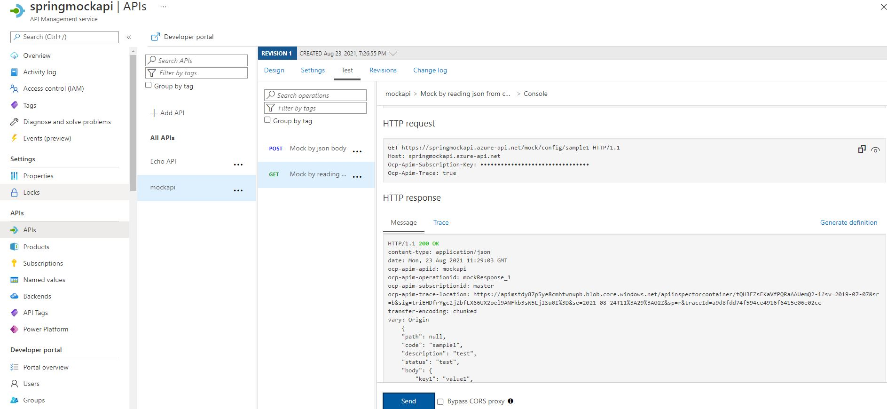

# Azure spring starter

## Pre-Requisites
1. Resource group
1. Azure AKS (external, publicly accessible) 
    1. Kubernetes ingress controller
1. Azure APIM (external, publicly accessible)




## Connect to aks cluster

1. Click on connect button from the portal

    

1. Run the ff commands on your local(with az and kubectl installed) CLI to connet to the cluster

    
    ```bash
    az login # This will give you a link to login your azure credentials via browser
    # it will wait for the process to complete then you will be automatically signed in to azure CLI
    # this login expires after a few hours, if you will be using az commands the following day, you will have to login again

    #these commands are available by clicking on Connect in your azure portal -- kubernetes service UI
    az account set --subscription <subscription-id>
    az aks get-credentials --resource-group demo --name demo-aks
    ```
    


## Clone Repo and its Submodules then deploy to aks


1. Clone the repository and its sub modules

    ```bash
    git clone git@github.com:migueltanada/azure-springboot.git --recurse-submodules
    ```

1. Create dev namespace and switch to that namespace

    ```bash
    kubectl create namespace dev
    kubectl config set-context --current --namespace dev
    ```

1. Deploy mockapi *_helm should be installed_

    ```bash
    cd mockapi
    helm install latest helm_repo/mockapi --set configmaps.env=dev --namespace dev
    cd -
    ```

1. Access the API by getting the service address of your ingres controller *_this wil only work if you did step 3_

    ```bash
    kubectl get svc ingress-nginx-controller
    ## Ip to be used is the one in External-IP column
    curl -k https://<ip>/mock/config/sample1
    ```

---

<br>
<br>

## Create APIM Endpoint


1. Open your azure portal and go to API Management

1. Click on springmockapi > API > Add > OpenApi Specification > Fill up the fields
    - OpenAPI specification: upload swagger.json from the repository you have cloned``./mockap/swagger.json``
    - display name: mockapi

    

    

1. Test the APi using test tab in azure portal

    


